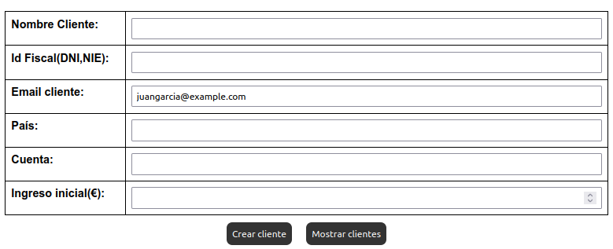

Creación:

creación, cliente y cuenta:

Mensaje Confirmación:

BBDD:

Creación cuenta en cliente existente:

Mensaje Confirmación:

BBDD:

Error al intentar crear cuenta existente:

Mensaje Confirmación:

Ver datos:

ver todos los clientes con sus cuentas:

Resultado:

Ver los Clientes con sus cuentas, filtrado por nombre:

nombre = "Juan García".

Resultado:

nombre = "%arc%".

Resultado:

Ver los clientes con sus cuentas, filtrado por idFiscal:
iD fiscal = "14325836E".

Resultado:

Ver los clientes con sus cuentas, filtrado por email:
email = "juangarcia@example.com".

Resultado:

Ver los clientes con sus cuentas, filtrado por país:
país = "españa".

Resultado:

Ver los clientes con sus cuentas, filtrado por cuenta:
cuenta = "ES120055775684902003". //Se muestran todas las cuentas del cliente, ya que se desea encontrar el cliente y sus cuentas buscándolo por número de cuenta.

Resultado:

Ver los clientes con sus cuentas, múltiples filtrados:

Resultado:

